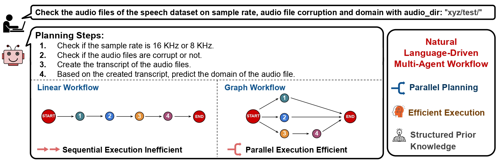
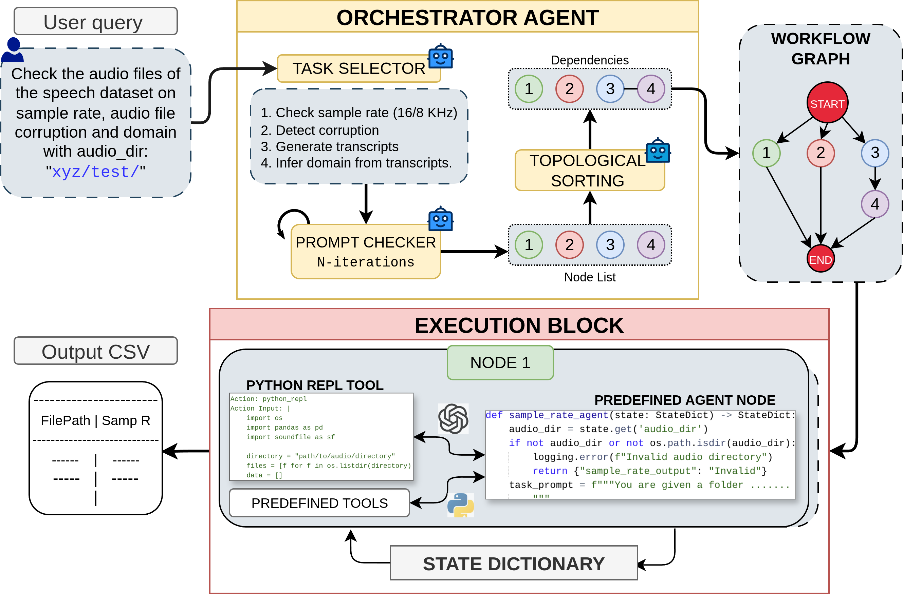
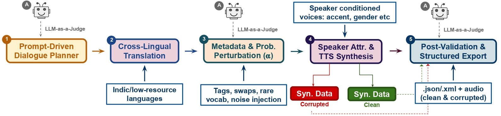

# SPEECHQC-AGENT: A Natural Language Driven Multi-Agent System For Speech Dataset Quality


**SpeechQC-Agent**, a natural language-driven, multi-agent framework designed for automatically verifying the quality of large-scale, multilingual speech-text datasets. Our system uses a central Large Language Model (LLM) to interpret user requests and orchestrate a set of specialized agents to perform audio, transcript, and metadata quality checks. To support this work, we're also releasing **SpeechQC-Dataset**, a realistic, synthetic benchmark of 15.5 hours of Hindi dialogue, which includes various error types to test the system.

We're building it to support more Dynamic and open-ended tasks, on transcripts as well as on audios! If you have any questions, please open an issue or email us!

<p align="center">
<a href=""></a>
</p>

## Framework Components

- **Central Planner**: Uses a central LLM to serve as the main interface for users. It takes a natural language prompt, like *"Check the audio files of the speech dataset..."*, and breaks it down into a structured list of actions. Put your token keys and prompt in `my_secrets.py`
- **Node Generation**: The action list is then converted into a series of executable nodes. I capture the dependencies between these nodes to create a Directed Acyclic Graph (DAG). This allows me to execute independent tasks in parallel.
- **Tooling**: Each verification node is associated with a tool that is either dynamically generated by an LLM or pulled from a pre-defined repository. This hybrid approach helps me handle new tasks while maintaining efficiency with common ones. See `utilities.py` for some predefined tools.
- **Execution**: The generated workflow is executed following the order defined by the DAG. Each node also has fail-safe conditions for more robust execution.
- **Output**: The final results from all completed tasks are compiled into a structured report, which provides a clear, human-interpretable summary of the data quality

<p align="center">
<a href=""></a>
</p>

## SpeechQC-Dataset
SpeechQC-Dataset, a synthetic dataset created using a multi-LLM pipeline. The dataset generation process involves several steps: we start with a prompt for an LLM agent to create a multi-turn conversation in English. This conversation is then translated into low-resource languages, such as Hindi. Metadata is extracted, and we probabilistically inject perturbations like HTML tags or token swaps to introduce controlled variability in text. Finally, a Text-to-Speech (TTS) model generates audio from the transcripts, and we can optionally corrupt the audio to simulate 24 real-world ASR challenges.

<p align="center">
<a href=""></a>
</p>

### Experimental Datasets
We introduced specific errors to the dataset using both rule-based and LLM-as-a-Judge approaches. This was done to thoroughly investigate data errors in speech-text datasets. Our system is designed to detect these errors across two major verification stages: 
**QC1 (Audio and Metadata Verification)** and **QC2 (Transcript and Content Verification)**. The QC1 checks include validating language, file format, sample rate, and speaker consistency. The QC2 checks focus on transcript quality, evaluating alignment, domain consistency, vocabulary coverage, and content duplication
Additionally, we have also utilized IndicVoices and Lahaja datasets by AI4Bharat for some of our experiments. 

## Quick Start

1. Set up the Python environment:
   ```bash
   # Create and activate a Python 3.9 virtual environment
   conda create -n <your_env_name> python=3.10

   # Install dependencies from yml file
   conda env update -n <your_env_name> -f env/denv.yml
   ```

2. Configure parameters and prompts:
   - Modify default parameters such as LLM API tokens and provide prompts in `my_secrets.py`:
     ```python
      HF_TOKEN = ""       # Hugging Face token
      GPT_API_KEY = " "   # GPT access
      GROQ_API_KEY = " "  # Groq key to experiment benchmark different LLMs
      PROMPT = "Classify domain on transcripts of the audio files located at '/path/to/audio/directory'."
       # user_prompt = "I want to check the number of speakers, calculate the duration for each speaker, verify if speakers are new or old, compute    WER, count English words, check for utterance duplicates, and clean the transcriptions by removing HTML tags in the audio files located at '/'."
       
    
     ```

3. Configure LLM parameters in `llm.py`. This file also supports Ollama to run inference of models locally.

4. While providing the Audio directory path, please provide *absolute path* and not a relative path.

5. If you are also providing transcript.csv, provide it in a folder named `results` in the same directory where the audio directory is located

6. Running and logging output:
   ```bash
   # After you have set up parameters in my_secrets
   python llm.py 2>&1 | tee log.txt
   ```
7. After successful completion, the output will be stored in the `results` folder

## Reproduce the Results in the Paper
1. We provide the raw output obtained from our experiments in the `outputs` folder. We have also provided the SpeechQC-dataset and results at [link](https://drive.google.com/drive/folders/1VOGTY486zEhL_H4hM5s1H2ONgRgwWYmg?usp=sharing). The dataset is divided into different Vendors with different quality defects to simulate real-world scenarios.

## Roadmap

- Support multiple Indian languages
- Support multimodal open-ended tasks
- Support more benchmarks

## Citation

If you use SpeechQC-Agent in your research, please cite our paper:

```

```
